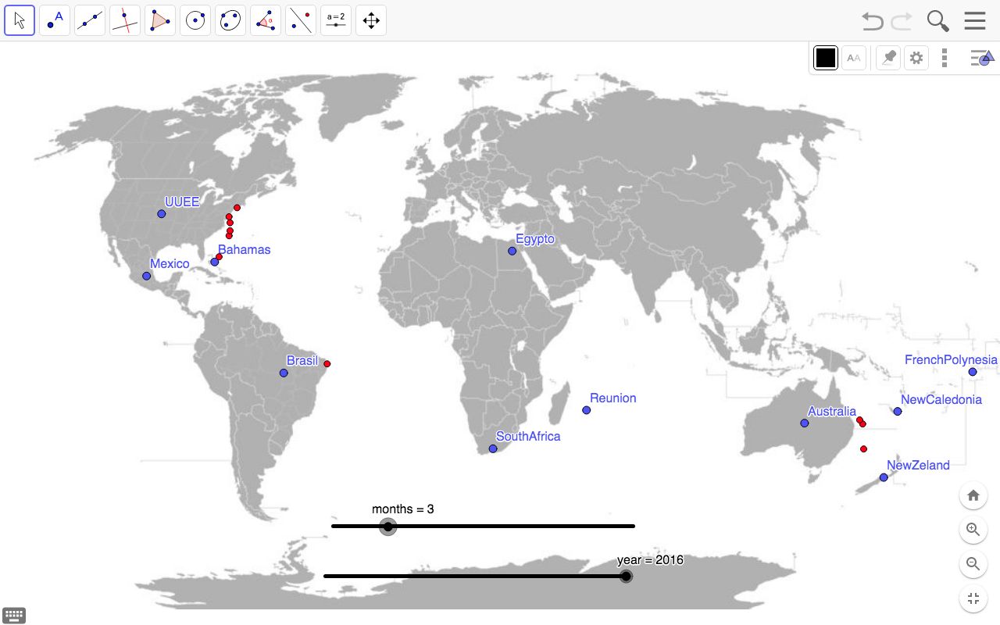

#   Project Ironhack Data Bootcamp

<b> JAVIER CARRASCO MORENTE

*Data Part Time Barcelona Dic 2019*

## Contenido

- [Proyecto Pandas](#project)
- [Dataset](#dataset)
- [Workflow](#workflow)

## Proyecto Pandas

-  El proyecto consiste en la limpieza y manipulacion de un dataset.

## Dataset

- El dataset es una lista de datos acerca de ataques de tiburones.

## Workflow

- La parte mas relevante del dataset son las fechas y localizacion de dichos ataques.
- En la primera parte hago una limpieza general de los datos.
- En la segunda parte hago una limpieza mas profunda de los años 2000 - 2016 para realizar una visualizacion.

### Pasos realizados con el Dataset
- Primera Parte:
    - Elimino las columnas que no tienen informacion relevante.
    - Corrijo el nombre de las columnas.
        - Algunas columnas contienen espacios y dificulta el acceso a ellas.
    - Cambio los valores 'Nan' to 'Unknown'.
    - Compruebo que las columnas 'Date' y 'Year' contengan la misma informacion.
        - Algunos datos en 'Year' estan incompletos y los completo con los datos de 'Date'.
        - Algunos datos erroneos que no coinciden decido eliminarlos.
    - Compruebo la columna 'Sex'.
        - Corrijo algunos datos erroneos con espacios.
        - Elimino los datos erroneos.
        - Cambio 'nan' por 'Unknow'.
- Segunda Parte:
    - Me quedo con los datos entre los años 2000 - 2016.
    - Modifico 'Date' en el formato dd-www-dd.
    - Añado una nueva columna con los meses a partir de la columna Date.
    - Añado una nueva columna con los dias a partir de la columna Date.
    - Ordeno  las columnas.
    - Creo nuevas columnas con las coordenadas en funcion de las coordenadas de los paises.
    - Exporto el csv para la visualizacion de los datos.
    - Dibujo los puntos de los ataques de tiburones en el mapa con Geogebra.
        - Utilizo dos sliders con meses y años para visualizar los puntos.

