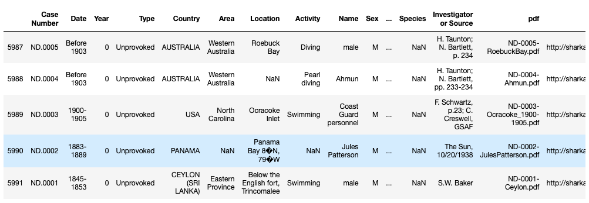
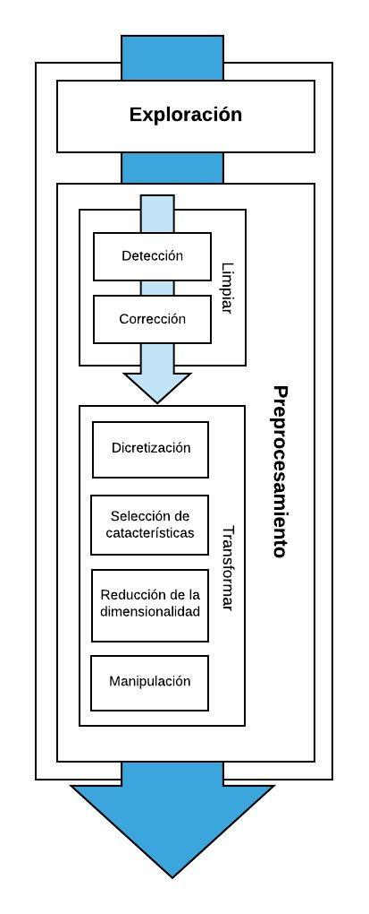

#   Pandas - Project Ironhack Data Bootcamp

Mar Lizana Atienza

*Data Part Time Barcelona Dic 2019*

## Content

<b><u>1  Proyecto Pandas - Ataque de tiburones</b></u>

<b>1.1  Origen y descripción de los datos</b>

<b>1.2  Preparación de los datos</b>

<b>1.3  Limpieza de datos</b>

<b>1.3.1  Normalización de los nombres de los atributos</b>

<b>1.3.2  Normalización y transformación de datos</b>

1.3.2.1  Year

1.3.2.2  Atributos del accidentado

Sex

Age

Country

1.3.2.3  Otros atributos

<b>1.3.3 </b> Discretización

1.3.3.1  Ages

1.3.3.2  Year to Century

<b>1.3.4</b>  Reducción de la dimensionalidad

<b>1.4  [BONUS] Visualización de resultados</b>

## Project Description

En este proyecto intentaremos adecuar el dataset dado, para ello usaremos técnicas y herramientas de manipulación y limpieza.
Nos centraremos en la estandarización de atributos concretos como <CODE>'sex'</CODE>, <CODE>'age'</CODE> y <CODE>'year'</CODE>.

## Dataset

En este conjunto de datos nos encontramos información relacionada con ataques de tiburones, incluye atributos de localización, de la víctima, de fecha y otros documentos relacionados.

Los campos con los que contamos de entrada son :

* <CODE>'Case Number'</CODE> : identificador del registro,
* <CODE>'Date'</CODE> : fecha en la que se ha producido el ataque,
* <CODE>'Year'</CODE> : año del ataque,
* <CODE>'Type'</CODE> : tipo de ataque, si ha sido provocado o no, etc.,
* <CODE>'Country'</CODE> : país en el que se ha producido el ataque,
* <CODE>'Area'</CODE> : área del país,
* <CODE>'Location'</CODE> : zona más concreta,
* <CODE>'Activity'</CODE> : acción que realizaba el/los accidentado/s
* <CODE>'Name'</CODE> : nombre del accidentado/s
* <CODE>'Sex '</CODE> : género,
* <CODE>'Age'</CODE> : edad/es
* <CODE>'Injury'</CODE> : heridas sufridas durante el ataque,
* <CODE>'Fatal (Y/N)'</CODE> : si este fue mortal o no,
* <CODE>'Time'</CODE> : hora a la que se produjo,
* <CODE>'Species '</CODE> : tipo de tiburón,
* <CODE>'Investigator or Source'</CODE> : fuente de la que se ha extraido la información(?)
* <CODE>'pdf'</CODE> : pdf,
* <CODE>'href formula'</CODE> : url que lleva al pdf,
* <CODE>'href'</CODE> : columna duplicada (<CODE>'href formula'</CODE>)
* <CODE>'Case Number.1'</CODE> : columna duplicada (<CODE>'Case Number'</CODE>),
* <CODE>'Case Number.2'</CODE> : columna duplicada (<CODE>'Case Number'</CODE>),
* <CODE>'original order'</CODE> : números del 1 al 5993, únicos por fila,
* <CODE>'Unnamed: 22'</CODE> : esta columna solo tiene un registro : 'stopped here'
* <CODE>'Unnamed: 23'</CODE> : esta columna tiene dos valores 'Teramo', 'change filename'

## Workflow

Hemos intentado seguir una estructura ordenada basada en el siguiente gráfico.

Gran parte del tiempo dedicado a este proyecto se ha centrado en la <b>exploración</b> de la base de datos para saber que atributos podían tratarse y cuales eran más complicados. Una vez decididos los campos a tratar nos hemos centrado en el proceso de <b>limpieza</b> donde hemos intentado normalizar tanto los nombres de los atributos como los valores de las observaciones. Por último, hemos seleccionado los atributos de mayor interés.
Como <b>BONUS</b> hemos añadido unos widgets para visualizar las observaciones según la elección de algunas de sus características.

## Results

shark_attacks.csv

